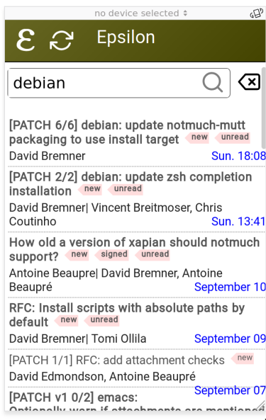

# Epsilon

" an arbitrarily small positive quantity"

Some day, a mobile-friendly web interface for the 
[notmuch mail client](https://notmuchmail.org/).  *Today, a giant gaping security hole that does nothing useful and you should not run* without careful inspection.




Don't say I didn't warn you.  What, you're still reading?

## Building/Installing

### Quick deployment/dogfood instructions for [Nix](https://nixos.org/nix/) users


```
$ nix-env -f 'https://github.com/telent/epsilon/archive/master.tar.gz' -i
$ epsilon :port 8111
$ $preferred_web_browser http://localhost:8111
```

### Development environment

You will need to have installed:

* nodejs (icons are installed from an npm package)
* clojure 1.9 with the cli tools (`clojure` should be on your path)
* [boot-clj](http://boot-clj.com/)

(On Nix you can do this using `nix-shell`)

First, install and convert the icons - this will create about 260 cljs
files in `generated/epsilon/icons/`

```
$ npm install
$ clojure  -A:build -m hiccupize-icons node_modules/feather-icons/dist/icons/
```

(On Nix you can do this by running `eval "$makeIcons"` in the nix-shell environemnt)


Next, you will want a couple of windows or tabs or similar.  In the first one run

```
tab1$ boot watch cljs target
```

and in the second

```
tab2$ boot use-target cider repl

epsilon.server=> (run {})
```


## Dependencies

Whenever you change `deps.edn` you also need to update `deps.json`.
Do this by running something like

```
$ CLJ_CONFIG=. CLJ_CACHE=. clojure -A:build -A:nixtract -Srepro  -Sforce  -m nixtract deps.json
```
